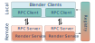

Architecture
============

We use `Blender <https://www.blender.org/>`_ to generate ground truth intensity frames at any arbitrary frame rate. To enable scalable simulations we employ a client/server architecture that uses remote procedure calls (RPCs) as the communication medium. A few minimal dependencies are injected within Blender's runtime which enables it to run as a server, listening for requests to set up scenes, move around cameras, render data, etc. Specifically, doing so from within Blender's runtime enables us to access all its features through the ``bpy`` package and expose them via RPCs. 

To orchestrate many rendering servers a registry server is spawned and listens for UDP-based broadcast messages from rendered servers that are available. This rendezvous server communicates with the main client to inform it about available workers, enabling the user to connect to the server instances and distribute work amongst the worker pool, or even use multiple render servers to render out a single animation. Servers manage their own logging and exception handling, and, in the event of some unexpected crash, we ensure that the dataset will not get corrupted and all process resources are freed. 

   Client/Server Rendering Architecture

This client/server architecture can drastically cut down on processing time and enables the use of a distributed set of machines with heterogeneous hardware. Even when worker processes are on the same machine, as is typically the case when using :meth:`BlenderClients.spawn <visionsim.simulate.blender.BlenderClients.spawn>` or :meth:`BlenderClients.pool <visionsim.simulate.blender.BlenderClients.pool>`, render times can be shorter as the system's resources will be better utilized. See the :doc:`Render API <../../sections/blender/rendering>` for examples of parallel distributed simulation.

