Types of Ground Truth 
=====================

Many types of ground truth annotations can be generated, some during the main rendering pass, and some as a post-processing step. Currently the following types are supported:

- **RGB Frames:** High quality, blur and noise free RGB images. These *have* to be generated due to a Blender limitation. If they are not needed, you can set the :meth:`max number of samples to 1 <visionsim.simulate.BlenderService.exposed_cycles_settings>` to minimize the overhead associated with frame generation.   
- **Depth Maps:** Scene distance for each pixel, a.k.a Z-buffers. These are depths inherit the units set within Blender (in Properties > Scene > Units) and are saved as full-precision floating point numbers in a single-channel EXR file. 
- **Normal Maps:** Surface normal vectors for each pixel. Each normal vector is of unit length and expressed in the camera's coordinate frame, with +X pointing to the right, +Y pointing up and +Z pointing into the camera (since the camera looks in the -Z direction, using the OpenGL/Blender coordinate system). These vectors are saved as floats in a 3-channel EXR file. 
- **Optical Flow:** 2D flow vector tracking the motion of each pixel between the current and next/previous frame. The former is dubbed forward flow, and the latter backwards flow. Both of these are saved as a 4-channel (RGBA) floating point EXR file, with the forward flow packed as RG and backwards flow as BA. 
- **Segmentation Maps:** Assign a unique object ID to each pixel. These are saved as single-channel integer EXR file. Multiple objects can be assigned the same ID if they are instances or made with modifiers (i.e: array modifier).
- **Camera Intrinsics & Extrinsics:** Camera intrinsic parameters such as focal lengths, camera model, distortion coefficients, principal point, and camera positions (extrinsics) are automatically recorded for every rendered frame and saved in a ``transforms.json`` file.  

.. - **Point Maps:**

.. admonition:: Coming Soon!

    Support for additional ground truth annotations such as scene flow and point maps will be added in a future release.

.. warning::
    
    Not all ground truth annotations are always available. Notably, while they are all compatible with CYCLES, they are not guaranteed to work with other rendering engines.

|

RGB Frames
----------

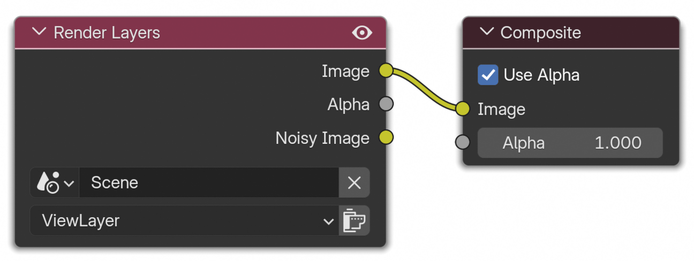

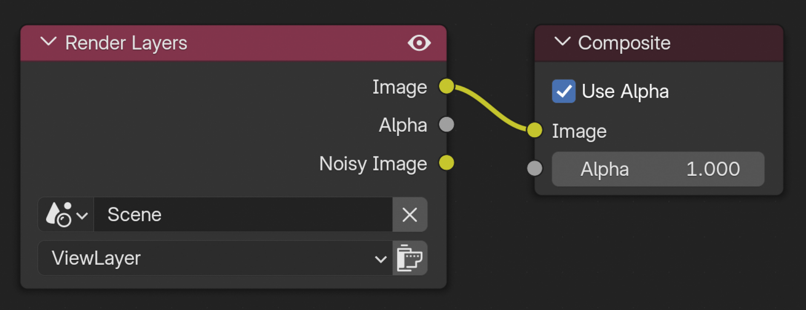

To render out RGB images, at a minimum, the "Image" render layer needs to be connected to the composite output node as shown on the right. These nodes are automatically added and enabled if they aren't already in the blend file. However, if a more complex compositing setup is present, it will not be modified.   

| 

Depth Maps
----------

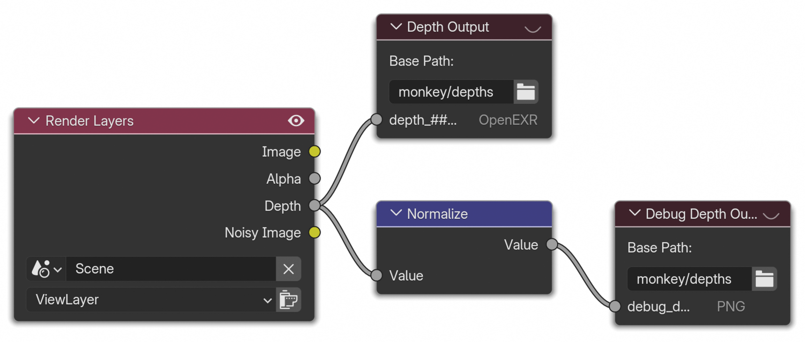

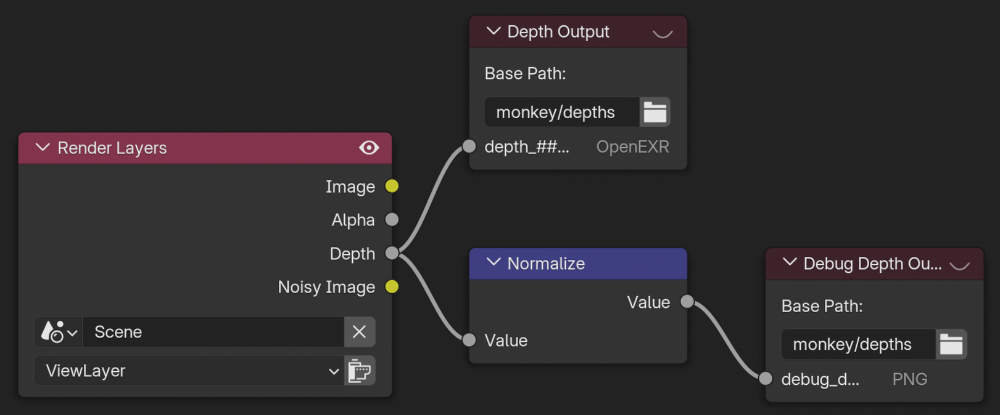

To generate ground truth depth maps, a Z-buffer render layer is added as well as the following compositor nodes. The depth map is saved directly as an EXR file, and if ``debug`` is enabled, it is normalized and saved as a grayscale PNG too. 

See :meth:`include_depths <visionsim.simulate.blender.BlenderService.exposed_include_depths>` for more. 

.. warning:: It is recommended to not use motion blur or depth of field when using depth maps. 

|

Normal Maps
-----------

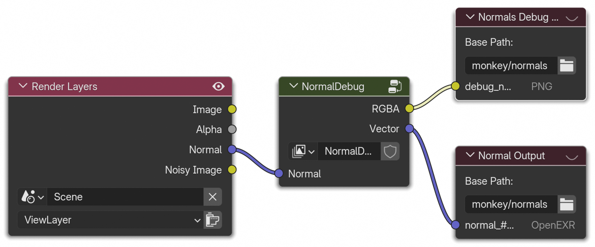

.. image:: ../../_static/blender/nodes/Normal-TopLevel-dark.png
   :align: right 
   :width: 50% 
   :class: only-dark

To render normal maps, the following compositor nodes are added. However, Blender's surface normal render layer outputs normals that are in world coordinates, yet normals maps are typically expressed in the camera coordinate frame. 

This conversion is ensured by the ``Normal Debug`` node, seen below, which takes the normals in world coordinates and maps them to the camera's coordinate frame. This node group outputs both the raw normals in camera space, and a colorized version for easy debugging, which maps XYZ coordinates to RGB.

As there is no matrix multiply compositor node, three dot product nodes and a combine-XYZ node are used to perform a matrix multiplier. The rows of the camera rotation matrix are automatically updated using `drivers <https://docs.blender.org/manual/en/latest/animation/drivers/index.html>`_ (purple). 

See :meth:`include_normals <visionsim.simulate.blender.BlenderService.exposed_include_normals>` for more. 

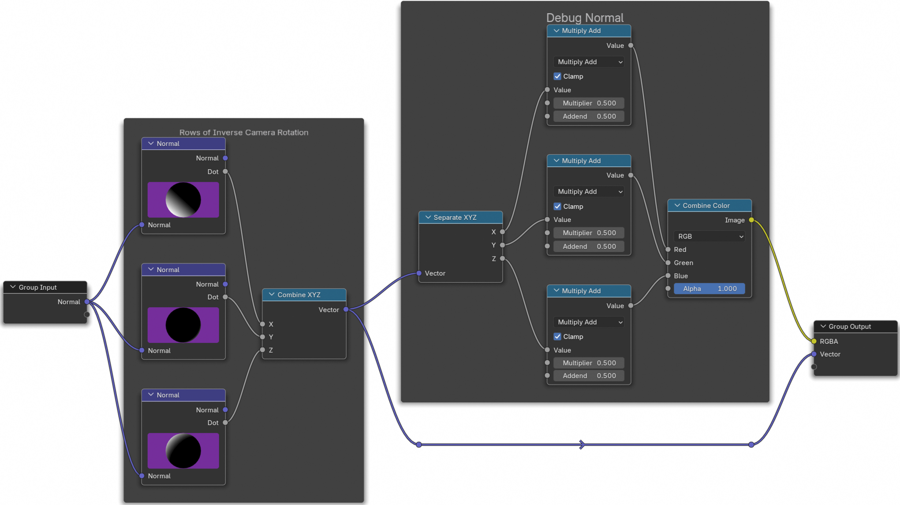

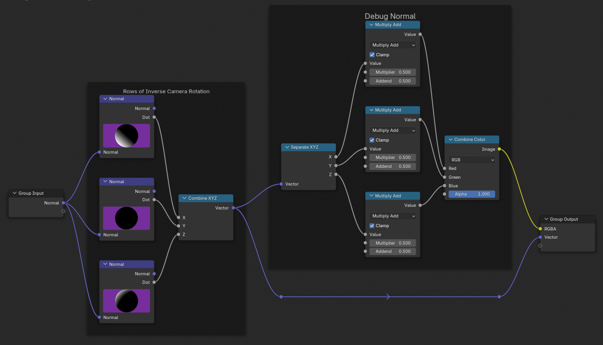

|

Optical Flow
------------ 

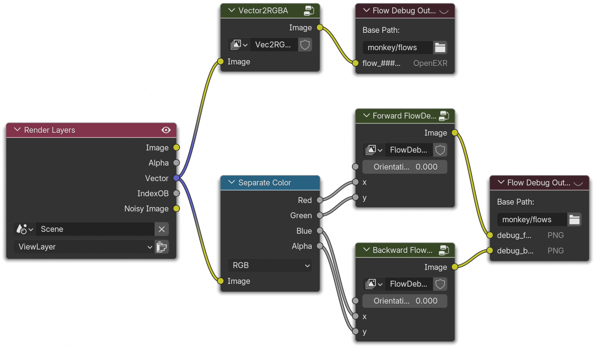

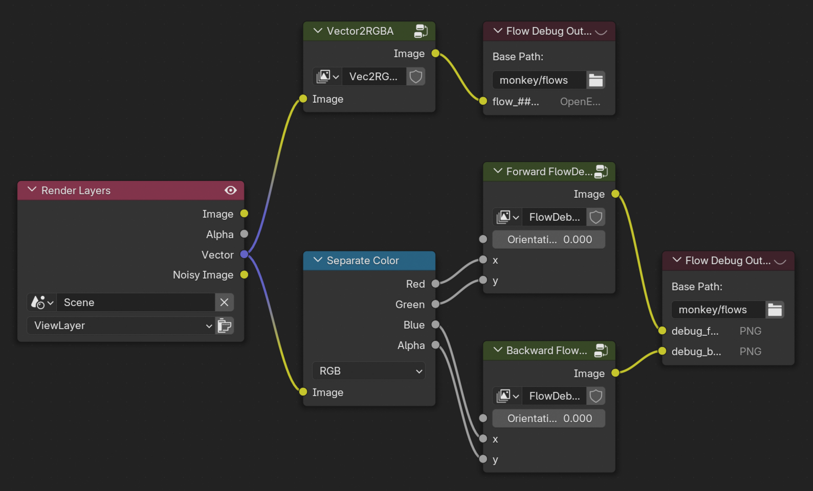

The vector pass adds both forward and backward optical flow. To save these, we add the following compositor nodes, the top branch saves the optical flow directly as an EXR while the bottom branch colorizes it and saves a preview of both the forward and backward flow as PNGs. 

The ``FlowDebug`` group node, seen below, colorizes optical flow by expressing the normal vectors in polar coordinates :math:`(\theta, r)` and using an HSV colormap, with the hue being determined by :math:`\theta` and saturation by a normalized :math:`r`. 

See :meth:`include_flows <visionsim.simulate.blender.BlenderService.exposed_include_flows>` for more. 

.. image:: ../../_static/blender/nodes/FlowDebug.png
   :align: center 
   :class: only-light

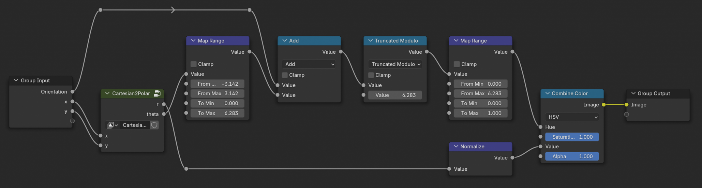

|

Segmentation Maps
-----------------

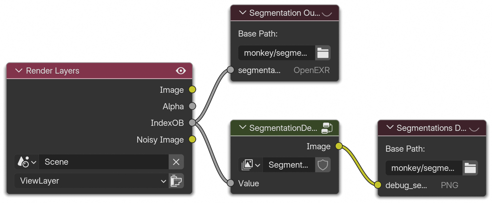

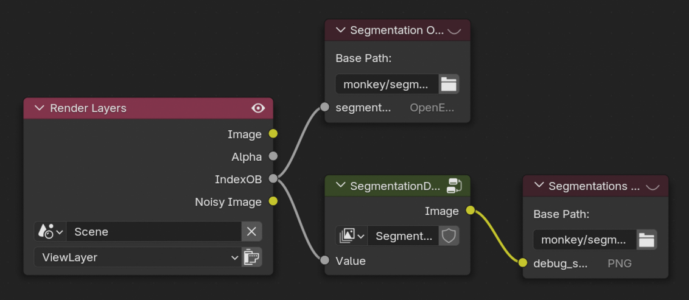

To generate segmentation maps, the following compositor nodes are added. The object index pass is enabled, which is directly saved as an EXR, or optionally colorized using the ``SegmentationDebug`` node shown below which assigns a unique color to each object index. 

See :meth:`include_segmentations <visionsim.simulate.blender.BlenderService.exposed_include_segmentations>` for more. 

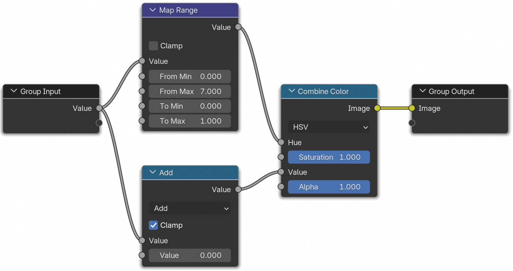

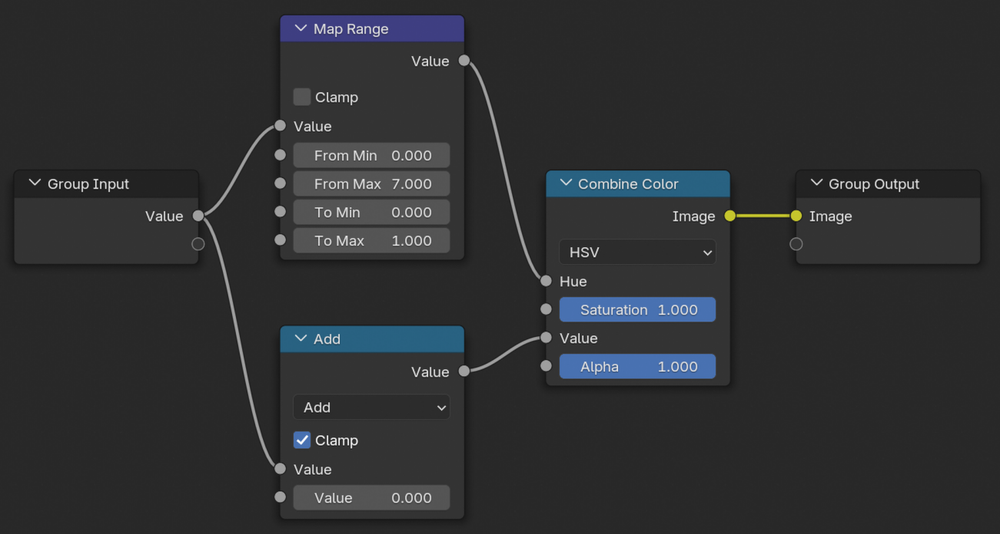

.. caution:: The ``From Max`` value of the Map Range node above determines which colors to sample. Internally, upon initialization this value is set to ``len(bpy.data.objects)``, however, if more objects are added after the fact then their colors might coincide. 

| 

Camera Intrinsics & Extrinsics
------------------------------

Intrinsics refer to camera parameters such as focal length, width and height, and any optical distortion parameters needed to map a pixel location to a ray in 3D space. Extrinsics, on the other hand, refers to camera pose, both rotation and position. These can be accessed using :meth:`camera_intrinsics <visionsim.simulate.blender.BlenderService.exposed_camera_intrinsics>`, :meth:`camera_extrinsics <visionsim.simulate.blender.BlenderService.exposed_camera_extrinsics>`, and will be returned by render methods such as :meth:`render_animation <visionsim.simulate.blender.BlenderService.exposed_render_animation>` too.

.. seealso:: :doc:`../datasets`

