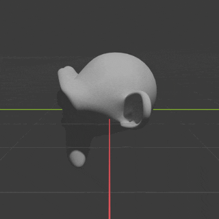

Keyframing
==========

An artist designing a 3D animation, does so by defining a set of *keyframes*. Each one holds a timestamp and set of attributes that need to be set to particular values at the timestamp. Upon rendering, Blender will interpolate attribute values between these different keyframes. For instance, we could say that at frame #1 the camera's focal length is 50mm and then at frame #20 it will be 100mm, then, if we render frame #10 we should expect a focal length of 75mm.

We make use of keyframes to define the camera trajectory, and to speed up/slow down time as needed. 

|

Setup a Trajectory
------------------

Using Blender's UI
^^^^^^^^^^^^^^^^^^

You can use a blender-defined camera animation too. To do this, first animate the camera in blender, there's a few ways to do this, namely:

* Make the camera follow a path 
* Directly keyframe the camera  

We won't go into details as to how to do this, there's an abundance of blender tutorials already. You can look at `this tutorial <https://www.youtube.com/watch?v=a7qyW1G350g>`_ or `this one <https://www.youtube.com/watch?v=K02hlKyoWNI>`_ for some examples.

Then, make sure the camera is not freed from its constraints/parents and keyframes by setting ``--no-unbind-camera`` and enabling ``--use-animations`` (enabled by default). You'll likely want to also specify at which frame to start/stop capture and you can do this with the ``frame-start`` and ``frame-step`` options as well as define the number of frames to capture with ``num-frames`` or the sequence end with ``frame-end``. Finally, you can also slow down the animation using the ``keyframe-multiplier`` argument.

|

Programmatically
^^^^^^^^^^^^^^^^

Camera positioning can be achieved programmatically as well, mainly using the :func:`position_camera <visionsim.simulate.blender.BlenderService.exposed_position_camera>` and :func:`rotate_camera <visionsim.simulate.blender.BlenderService.exposed_rotate_camera>` methods of a connected render client. It is preferred to set and keyframe the camera position and render them all at once rather than than moving the camera and rendering an individual frames in lockstep.  Not only is it more efficient, but some ground truth annotations, notably optical flow require advance knowledge of where the next camera position will be in order to function properly. 

Here we keyframe the camera to rotate around the origin with a radius of 5, always look towards the center, and rotate around it's optical axis:  

.. Make gif with: 
    gifski renders/monkey/frames/*.png --fps 25 -o keyframing-api.gif --width=320 --height=320

.. literalinclude:: ../../../../examples/blender/render_custompath.py 
   :lines: 15-20
   :dedent: 

Now, if we render this scene, it will result in the following animation: 

.. tip:: 
    The camera might already be constrained to a path or object, which can result in the camera positioning not working as expected. In these cases it is helpful to :func:`unbind the camera <visionsim.simulate.blender.BlenderService.exposed_unbind_camera>` from any external constraints. 

|

Keyframe Stretching
-------------------

Keyframes are tied to frame numbers not relative animation time, so while this works well when the artist knows the framerate of the final render, if they animate for 30fps but render it at 120fps, the animation will be four times too fast. 

This is where keyframe stretching comes in, it allows for a decoupling between rendering framerate and animation framerate. The ``keyframe-multiplier`` option of ``blender.render-animation`` controls this stretch factor. In the above example, we would set ``--keyframe-multiplier=4.0`` to get the desired animation, or we could reuse existing animations and render them at single photon camera framerates using a higher multiplier.  

