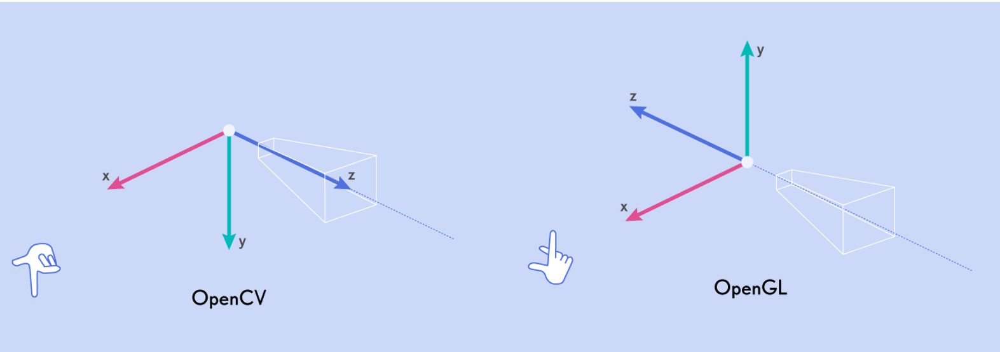

Data Format and Loading
=======================

Typical Folder Structure
------------------------

If you've followed the quickstart guide, you'll end up with roughly the following folder structure::

    <SCENE-NAME>
    ├── frames
    │   ├── 0000
    │   │   ├── 000.png
    │   │   ├── 001.png
    │   │   └── ...
    │   ├── 0001/
    │   ├── ....
    │   └── transforms.db
    ├── spad
    │   ├── 0000.npy
    │   ├── 0001.npy
    │   ├── ....
    │   └── transforms.json
    ├── depths/
    ├── flows/
    ├── normals/
    ├── segmentations/
    └── previews
        ├── depths/
        ├── flows/
        │   └── forward/
        ├── normals/
        └── segmentations/

.. note:: Note: Here we have elided some subfolders for brevity, these will be similar in layout.

Each subfolder consists of a metadata file, namely a ``transforms.db`` or ``.json`` as well as multiple data files which can be image files or numpy arrays. 

|

Metadata Files
--------------

Every dataset, or subset thereof, needs to contain a valid ``.json`` or ``.db`` file which contains camera parameters, extrinsics, and crucially, the paths to the data. These two metadata files contain much of the same information where the JSON one is more general purpose and compatible with existing frameworks, and the database version being tailored for distributed simulation.

|

The ``transforms.json`` Format
^^^^^^^^^^^^^^^^^^^^^^^^^^^^^^

This format is meant to be a superset of `Nerfstudio-like formats <https://docs.nerf.studio/quickstart/data_conventions.html#dataset-format>`_ and should be familiar to a lot of users. Notably, optional keys, such as ``c`` (channel size), ``fps``, ``offset`` and ``bitpack_dim`` have been added which support saving the data as a numpy file.

The transforms file adheres to, at a minimum, the following schema::

    JSON_SCHEMA = {
        "fps": Camera framerate (optional)
        "fl_x": Focal length in X
        "fl_y": Focal length in Y
        "cx": Center of optical axis in pixel coordinates in X
        "cy": Center of optical axis in pixel coordinates in Y
        "w": Sensor width in pixels
        "h": Sensor height in pixels
        "c": Number of output channels (optional, i.e: RGBA = 4)
        "frames": List of frames where each frame follows IMG_FRAME_SCHEMA
    }

    JSON_FRAME_SCHEMA = {
        "transform_matrix": 4x4 transform matrix
        "file_path": Path to color image, relative to parent dir
        "bitpack_dim": Dimension that has been bitpacked (optional)
        "offset": Index of frame, used when ``file_path`` is an ``.npy`` file (optional)
        <Per-frame camera intrinsics>
    }

Per frame camera intrinsics are supported (except ``camera_model``) as long as all frames have those attributes defined, and they are not defined at the top level.

This schema is programmatically defined, and validated at runtime, through the :class:`Metadata <visionsim.dataset.models.Metadata>` class. 

|

The ``transforms.db`` Format
^^^^^^^^^^^^^^^^^^^^^^^^^^^^

The above format is fairly standard, yet a bit limiting. For instance, when rendering ground truth data using Blender there's a lot of extra information we could store that is incompatible with this json schema, and adding arbitrary data to it would just result in bloat. Additionally, storing all metadata in a single json file can cause data integrity issues when multiple parallel workers try to access the file.    

Because of this, the output format used when rendering a scene is a SQLite database, usually named ``transforms.db``, which loosely mirrors the above format yet enables access from many threads. This database format, which contains three tables (``_Camera``, ``_Frame`` and ``_Data``), is mainly meant as an internal format but conversions to and from are possible using the :meth:`dataset.convert CLI <visionsim.cli.dataset.convert>`.  

|

Data Files
----------

The metadata files point to the data files which actually contain the frame data. These can be a variety of image formats, EXRs and HDRs, or numpy arrays.

Which data type is used for what depends on a few things such as if the data can be stored as integers, if a lossy format is acceptable and so forth. For instance, the numpy format, stored as ``.npy`` files, hav several benefits:

- Numpy arrays can be memory mapped, enabling us to manipulate larger-than-RAM arrays efficiently and easily. This is particularly important when sampling pixels as we do not need to read and decode a whole image to sample a single pixel.

- We are not constrained by an image codec, meaning we can for instance use higher precision floats (although EXRs support this), losslessly save data, and in the case of binary valued SPC data, we can bitpack it which enables compression.

- Dataset integrity is easier to check as it's just an npy file and it's accompanying transforms file as opposed to thousands of image files.

...and a few drawbacks:

- Not directly compatible with existing tooling, although reading from an npy file is easy.

- Can create very large single files.

|

Data Loading
------------

Utilities for efficiently iterating over datasets can be found in :mod:`visionsim.dataset`. For instance we can iterate over a dataset of frames like so:

.. code-block:: python

    from visionsim.dataset import Dataset 

    dataset = Dataset.from_path("renders/frames/")

    for data, transform in dataset:
        ...

Here, the ``transform`` variable will be a dictionary containing camera information such as pose and focal length, as well as any additional information read from the metadata file. If you want to load data from a set of files that do not have an associated metadata file, you can use :meth:`Dataset.from_paths <visionsim.dataset.dataset.Dataset.from_paths>` or :meth:`Dataset.from_pattern <visionsim.dataset.dataset.Dataset.from_pattern>` instead, however in that case the ``transform`` dictionary will not contain camera information, only data loading info such as ``file_path``. 

To just load a single frame, you can use :meth:`Dataset.load_data <visionsim.dataset.dataset.Dataset.load_data>` which will load, and optionally slice, data from disk. It is recommended to use this instead of a third party library as it accounts for certain issues related to reading EXRs and numpy arrays.  

|

Coordinate Conventions
----------------------

The camera poses stored in ``transforms.json`` files follow Blender/OpenGL/NeRF camera conventions where +X is right, +Y is up, and +Z is pointing back and away from the camera, making the camera's viewing direction -Z. Another common convention is the OpenCV/COLMAP convention, which uses the same X axis, with +Y going down and +Z going into the scene.   

   Camera coordinate conventions (`source <https://medium.com/@christophkrautz/what-are-the-coordinates-225f1ec0dd78>`_)
