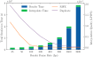

Interpolation
=============

Interpolation refers to filling in the gaps between observations, in our case we use ``frame`` -based video interpolation methods, along with pose interpolation, to speed up rendering.   

Methods
-------

Many ``frame`` -based interpolation methods exist, currently we support the following:

* `RIFE (ECCV 2022) <https://github.com/hzwer/ECCV2022-RIFE>`_
* ... more to come!

To interpolate the camera trajectory, we simply linearly interpolate the camera position and spherically interpolate camera rotations.

Artifacts
---------

Video interpolation is an inherently ambiguous task -- it is inconceivable to re-create a whole movie by interpolating it's first and last frame -- yet, when input frames are close enough, the problem becomes significantly simpler. We use this key insight to our advantage, we do not need to render ground truth frames at the framerate of a single photon camera, we can instead render them at framerate that is sufficient to capture most scene motion, and then interpolate the rest of the way.       

What framerate to render at depends entirely on the scene, it's geometry and textures and how fast the relative motion is. To illustrate this point, we've taken the scene for the :doc:`quickstart guide <../quick-start>` and rendered it at different framerates and interpolated it to 400 fps:

.. list-table::
    :class: borderless

    * - .. figure:: ../_static/lego0025-interp.gif

            6.25 fps interpolated 64x

      - .. figure:: ../_static/lego0050-interp.gif

            12.5 fps interpolated 32x

    * - .. figure:: ../_static/lego0100-interp.gif
                
            25 fps interpolated 16x

      - .. figure:: ../_static/lego0200-interp.gif

            50 fps interpolated 8x

As you can see, *for this scene*, we need to render at a minimum of 50fps for artifacts to become imperceptible. Here we've interpolated the 50fps render only 8x, but we can interpolate it much more without creating additional artifacts since adjacent frames are similar enough.

This effect can be shown quantitatively too. In the figure below, which was computed for a different scene, we rendered a test trajectory at many different frame rates and in each case interpolated the resulting data up to a common frame rate of 6400fps, either using RIFE or simple frame duplication. We plot the average perceptual similarity between these interpolated frames and ground truth data (lower is better), as well as the total wall time to render and interpolate these different datasets as measured using a single rendering job, on an Nvidia RTX 3080. 

   Rendering/Interpolation Tradeoff
   

Notice that the time it takes to interpolate the frames is dwarfed by rendering time. The overall quality of the data improves with higher frame rates and lower interpolation factors, hitting an inflection point around 200fps, after which there are diminishing returns as rendering time explodes. From this, we can see that *for this specific scene* the native frame rate is around two to four hundred frames per second when using RIFE as the interpolation method, and below this rate we incur significant interpolation artifacts as shown. It takes just under 20 minutes to render this scene at 400fps and interpolate it 16x to 6.4kHz, as compared to over four hours if we rendered every frame. 