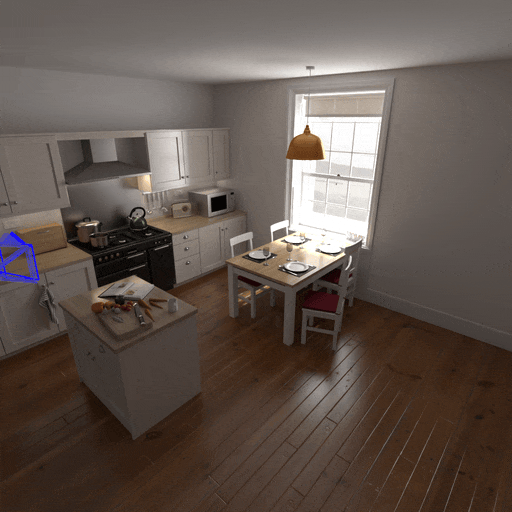

Inertial Measurement Unit
=========================

.. image:: https://upload.wikimedia.org/wikipedia/commons/7/7f/SparkFun_9DoF-IMU-Breakout_LSM9DS1_13284-03.jpg
   :width: 20% 
   :align: right 

An inertial measurement unit (IMU) is chip that measures acceleration and angular velocity using a accelerometers and gyroscopes, typically one per axis. These devices are widespread, and play a crucial role in tracking the movement of devices as their measurements can be integrated to estimate the current orientation of the sensor. 

However, these suffer from various types of noise which leads to loss of precision over time, in a phenomenon dubbed drift. Carefully characterizing this drift is important as it directly correlates with the sensor's accuracy and with the amount of times IMU-derived position estimates are valid. 

From `Wikipedia <https://en.wikipedia.org/wiki/Inertial_measurement_unit>`_:

    A very wide variety of IMUs exists, depending on application types, with performance ranging:
        - From 0.1°/s to 0.001°/h for gyroscope
        - From 100 mg to 10 μg for accelerometers.
        
    To get a rough idea, this means that, for a single, uncorrected accelerometer, the cheapest (at 100 mg) loses its ability to give 50-meter accuracy after around 10 seconds, while the best accelerometer (at 10 μg) loses its 50-meter accuracy after around 17 minutes.

|

Sensor Modeling
---------------

The measurements captured by an IMU can be modeled as the ground truth acceleration and angular rates with added noise. More formally, Leutenegger et al. [1]_ defines this process like so:

    An IMU measures the rotation rate and the acceleration of the sensor with respect to an inertial frame. The measurements, namely :math:`{}_{\mathrm{B}}\tilde{\boldsymbol{\omega}}_{\mathrm{WB}}(t)` and :math:`{}_{\mathrm{B}}\tilde{\mathbf{a}}(t)`, are affected by additive white noise :math:`{\boldsymbol{\eta}}` and a slowly varying sensor bias :math:`\mathbf{b}`:

    .. math:: 
        \begin{align*}
            {}_{\mathrm{B}}\tilde{\boldsymbol{\omega}}_{\mathrm{WB}}(t) &= {}_{\mathrm{B}}\boldsymbol{\omega}_{\mathrm{WB}}(t) + \mathbf{b}^g(t) + \boldsymbol{\eta}^g(t) \\
            {}_{\mathrm{B}}\tilde{\mathbf{a}}(t) &= \mathbf{R}_{\mathrm{WB}}^\top(t) \left( {}_w\mathbf{a}(t) - {}_w\mathbf{g} \right) + \mathbf{b}^a(t) + \boldsymbol{\eta}^a(t)
        \end{align*}

    In our notation, the prefix B denotes that the corresponding quantity is expressed in the frame B (the IMU's frame, a.k.a the "body" frame). The pose of the IMU is described by the transformation :math:`\left\{\mathbf{R}_{\mathrm{WB}}, {}_w\mathbf{p}\right\}` which maps a point from sensor frame B to W (the world coordinate frame). The vector :math:`{}_{\mathrm{B}}\boldsymbol{\omega}_{\mathrm{WB}}(t)\in\mathbb{R}^{3}` is the instantaneous angular velocity of B relative to W expressed in coordinate frame B, while :math:`{}_w\mathbf{a}(t)\in\mathbb{R}^{3}` is the acceleration of the sensor; :math:`{}_w\mathbf{g}` is the gravity vector in world Coordinates. 

This sensor modeling is incorporated into :func:`emulate_imu <visionsim.emulate.imu.emulate_imu>`, which, when given appropriate noise parameters, gravity direction and ground truth poses, will emulate the above random walk and generate accelerometer and gyroscope readings. 

To emulate an IMU from a ``transforms.json`` file, we can also use the CLI::

    $ visionsim emulate.imu --input-dir=path/to/transforms.json --output-file=imu.csv --dt=0.02

Where ``dt`` is the sampling period or the IMU, set here to 50Hz. This will output a CSV (comma separated values) table like so:

+------+---------+--------+---------+---------+---------+---------+-------------+-------------+-------------+
| t    | acc_x   | acc_y  | acc_z   | gyro_x  | gyro_y  | gyro_z  | bias_ax     | bias_ay     | bias_az     |
+======+=========+========+=========+=========+=========+=========+=============+=============+=============+
| 0    | -2.2421 | 9.3807 | -4.9132 | 0.0072  | -0.0048 | -0.0054 | 0           | 0           | 0           |
| 0.02 | -2.1713 | 9.2758 | -4.9026 | 0.0052  | -0.0115 | 0.0025  | 1.8007e-06  | -3.4000e-06 | 5.5357e-06  |
| 0.04 | -2.0358 | 9.3330 | -4.8106 | 0.0146  | -0.0080 | -0.0006 | 6.7951e-07  | -2.4913e-05 | -4.0781e-06 |
| 0.06 | -2.1025 | 9.3745 | -4.6503 | -0.0031 | -0.0063 | 0.0022  | -6.9008e-08 | -2.1221e-05 | -1.9061e-05 |
| 0.08 | -2.0334 | 9.3777 | -4.6613 | 0.0058  | -0.0020 | -0.0171 | 8.2615e-06  | -1.0654e-05 | -2.4797e-05 |
| 0.1  | -2.0380 | 9.4258 | -4.5916 | -0.0124 | -0.0044 | 0.0066  | 4.6997e-06  | -6.5517e-06 | -3.7947e-05 |
| ...  | ...     | ...    | ...     | ...     | ...     | ...     | ...         | ...         | ...         |
|      |         |        |         |         |         |         |             |             |             |
|      |         |        |         |         |         |         |             |             |             |
+------+---------+--------+---------+---------+---------+---------+-------------+-------------+-------------+

| 

Estimating Pose 
---------------

Using these readings we can estimate the orientation of the IMU. 

While many methods exist, one of the simplest and most ubiquitous is to simply integrate these measurements over time. This technique, called motion integration is implemented in :func:`imu_integration <visionsim.emulate.imu.imu_integration>` and can be used like so:

.. literalinclude:: ../../../../examples/sensors/imu.py 

.. TODO: add link to `examples/sensors/render-camera-geonodes.png` when repo is public 

Using a bit of Blender's geometry [2]_ nodes we can composite a few estimated trajectories back into the scene:

Here, the bright blue camera follows the ground truth trajectory, and all others are estimated from IMU measurements. Notice how they all start grouped together and slowly drift apart. 

| 

.. [1] `Leutenegger et al. (2015), "Keyframe-based visual-inertial odometry using nonlinear
        optimization". <https://www.roboticsproceedings.org/rss09/p37.pdf>`_
.. [2] This is beyond the scope of this tutorial, it requires knowledge of geometry nodes and Blender scripting.
