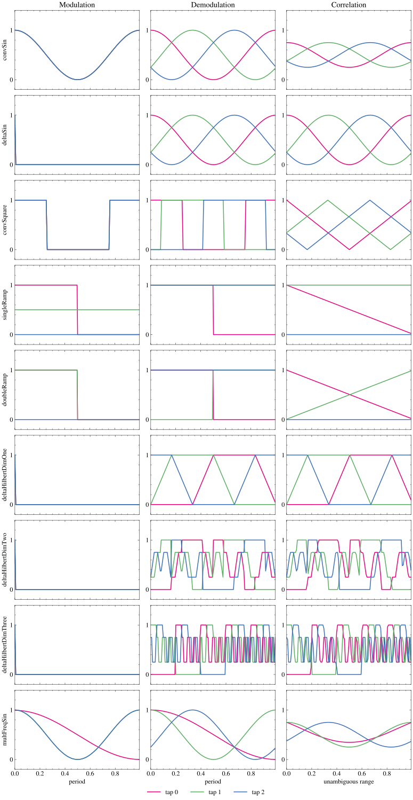
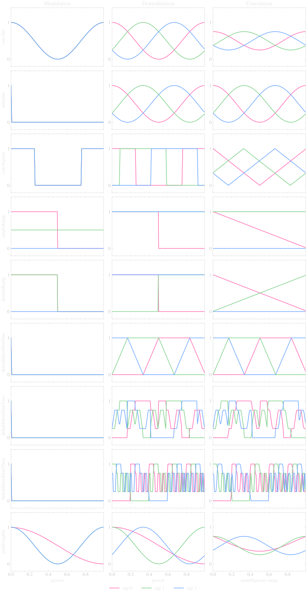

Indirect Time-of-Flight
=======================

Indirect time-of-flight (iToF) sensors illuminate the scene with a modulated light source, typically near-infrared, and correlate the returning signal with a reference modulation inside each pixel. A scene point at depth :math:`d` delays the light by :math:`2d/c` with respect to the modulation, and the measured phase is proportional to that delay:

.. math::
    d = \frac{c \, \varphi}{4 \pi f}

where :math:`\varphi` is the recovered phase and :math:`f` the modulation frequency. Because the phase is only defined modulo :math:`2\pi`, iToF is unambiguous only within

.. math::
    d_\text{max} = \frac{c}{2f}

which is roughly :math:`1.25\,\text{m}` at :math:`f = 120\,\text{MHz}`; the ramp schemes described below only reach half of that. Scene points beyond the range *fold* back into the recovered depths: the phase wraps, but the radiometric falloff still tracks the true distance.

|

Sensor Modeling
---------------

The model follows the lock-in principle used by continuous-wave iToF sensors: the emitter is modulated, the returning light is optically mixed with a reference waveform inside every pixel, and the resulting correlation is sampled :math:`K` times with different reference phase offsets [2]_, [3]_. :math:`K` is the number of taps in one acquisition (``n_captures`` in the Python API), and :math:`k` indexes them from :math:`0` to :math:`K-1`.

The emitted modulation :math:`m(t)` and the :math:`k`-th reference waveform :math:`r_k(t)` are unit-period sinusoids, with :math:`t` in seconds and :math:`\varphi_k` the phase offset of tap :math:`k`:

.. math::
    m(t) &= \tfrac{1}{2}\left(1 + \cos(2\pi f t)\right) \\
    r_k(t) &= \tfrac{1}{2}\left(1 + \cos(2\pi f t - \varphi_k)\right), \qquad \varphi_k = \frac{2\pi k}{K}

Light that travelled to a scene point of albedo :math:`\alpha` at depth :math:`d` returns delayed by :math:`\tau = 2d/c` and attenuated by the inverse-square radiometric falloff, giving the returning irradiance :math:`m_d(t)`. Here :math:`\beta = \alpha / d^2` is the received signal amplitude and :math:`\tau` is the round-trip time of flight:

.. math::
    m_d(t) = \beta \left(1 + \cos\left(2\pi f (t - \tau)\right)\right), \qquad \beta = \frac{\alpha}{d^2}

Each tap integrates the product of the returning irradiance with its reference waveform over the exposure time :math:`T_\text{exp}`, an integer number of modulation periods :math:`T = 1/f`. The result is :math:`m_k`, the measurement of tap :math:`k`:

.. math::
    m_k = \int_{T_\text{exp}} m_d(t)\, r_k(t)\, dt
        = \underbrace{\frac{T_\text{exp}\,\beta}{2}}_{A} + \underbrace{\frac{T_\text{exp}\,\beta}{4}}_{B} \cos\left(\varphi_k - \varphi\right)
        = A + B \cos\left(\varphi_k - \varphi\right)

:math:`A` is the depth-independent offset of every tap and :math:`B` their modulation amplitude. The phase that encodes depth is :math:`\varphi = 2\pi f \tau = 4\pi f d / c`. Every capture therefore measures a phase-shifted cosine of the same :math:`\varphi`, and recovering depth means recovering :math:`\varphi` from the :math:`K` samples. For this waveform pair the modulation depth is fixed at :math:`B/A = 1/2`.

Ambient light adds a depth-independent offset: light that does not originate from the emitter contributes :math:`T_\text{exp} P_\text{ambient} \alpha / 2` to every tap, which is why :math:`A` has to be fitted (or cancelled) rather than assumed known. The full model implemented by :func:`simulate_measurements <visionsim.emulate.itof.simulation.simulate_measurements>` is

.. math::
    m_k = \frac{T_\text{exp}}{T_\text{period}} \left( \beta \, C_k(d) + P_\text{ambient} \, \kappa_k \, \alpha \right)

with :math:`T_\text{period}` the code period. :math:`C_k(d)` is the circular correlation of the modulation with the :math:`k`-th reference code, sampled at :math:`d` modulo :math:`d_\text{max}`, and :math:`\kappa_k` is the integral of that reference code over one period. Arbitrary coding functions replace :math:`A + B\cos(\varphi_k - \varphi)` by :math:`C_k(d)`. The coding schemes below differ in how well the resulting measurements :math:`\{m_k\}` separate depth, albedo and ambient light; Gupta et al. [1]_ study which coding functions do that optimally.

.. note::

    The emulator produces noiseless measurements. Shot noise (which would scale with :math:`\sqrt{m_k}`), read noise, quantization, and motion or blur effects are not simulated [4]_, so the emulated taps are the correlation samples an ideal sensor would report.

|

Coding Schemes
--------------

The modulation and reference waveforms determine how well a sensor separates depth, albedo and ambient light. The following coding functions are implemented, following Gupta et al. [1]_:

.. list-table:: Implemented coding schemes
    :header-rows: 1
    :widths: 15 9 47 29

    * - Scheme
      - Captures
      - Encoder / Decoder
      - Notes
    * - ``convSin``
      - 3-5
      - :func:`make_conv_sinusoidal_codes <visionsim.emulate.itof.coding.make_conv_sinusoidal_codes>` :math:`\rightarrow` :func:`decode_sinusoid <visionsim.emulate.itof.decoding.decode_sinusoid>`
      - Conventional sinusoidal modulation
    * - ``deltaSin``
      - 3-5
      - :func:`make_delta_sinusoidal_codes <visionsim.emulate.itof.coding.make_delta_sinusoidal_codes>` :math:`\rightarrow` :func:`decode_sinusoid <visionsim.emulate.itof.decoding.decode_sinusoid>`
      - Impulse (delta) modulation
    * - ``convSquare``
      - 3-5
      - :func:`make_conv_square_codes <visionsim.emulate.itof.coding.make_conv_square_codes>` :math:`\rightarrow` :func:`decode_square <visionsim.emulate.itof.decoding.decode_square>`
      - Square-wave modulation and reference
    * - ``singleRamp``
      - 3
      - :func:`make_single_ramp_codes <visionsim.emulate.itof.coding.make_single_ramp_codes>` :math:`\rightarrow` :func:`decode_single_ramp <visionsim.emulate.itof.decoding.decode_single_ramp>`
      - Usable range is only :math:`c/4f`
    * - ``doubleRamp``
      - 3
      - :func:`make_double_ramp_codes <visionsim.emulate.itof.coding.make_double_ramp_codes>` :math:`\rightarrow` :func:`decode_double_ramp <visionsim.emulate.itof.decoding.decode_double_ramp>`
      - Usable range is only :math:`c/4f`
    * - ``deltaHilbertDimOne``
      - 3-6
      - :func:`make_delta_hilbert_codes <visionsim.emulate.itof.coding.make_delta_hilbert_codes>` with ``dim=1`` :math:`\rightarrow` :func:`decode_hilbert <visionsim.emulate.itof.decoding.decode_hilbert>`
      - Gray-coded, continuous in time; codes via :func:`make_tof_gray_codes <visionsim.emulate.itof.coding.make_tof_gray_codes>`
    * - ``deltaHilbertDimTwo``
      - 4-5
      - :func:`make_delta_hilbert_codes <visionsim.emulate.itof.coding.make_delta_hilbert_codes>` with ``dim=2`` :math:`\rightarrow` :func:`decode_hilbert <visionsim.emulate.itof.decoding.decode_hilbert>`
      - 2-D Hilbert curve codes, via :func:`make_tof_hilbert_codes <visionsim.emulate.itof.coding.make_tof_hilbert_codes>`
    * - ``deltaHilbertDimThree``
      - 5
      - :func:`make_delta_hilbert_codes <visionsim.emulate.itof.coding.make_delta_hilbert_codes>` with ``dim=3`` :math:`\rightarrow` :func:`decode_hilbert <visionsim.emulate.itof.decoding.decode_hilbert>`
      - 3-D Hilbert curve codes, via :func:`make_tof_hilbert_codes <visionsim.emulate.itof.coding.make_tof_hilbert_codes>`
    * - ``multFreqSin``
      - 4 or odd :math:`\geq 5`
      - :func:`make_multi_freq_sinusoidal_codes <visionsim.emulate.itof.coding.make_multi_freq_sinusoidal_codes>` :math:`\rightarrow` :func:`decode_mult_freq_sinusoid <visionsim.emulate.itof.decoding.decode_mult_freq_sinusoid>`
      - Several frequencies per capture set; needs ``freq_vec`` and ``shifts_vec``. At four captures the three shifted taps of one frequency must be the widest group, so the single low-frequency tap cannot be used to widen the range

The figure below shows each scheme as a row, with the emitter waveform, the demodulation waveform of each tap, and the correlation function that tap measures over depth:

The sinusoidal schemes differ only in their emitters, since both mix against the same sinusoidal reference: a continuous sinusoid for ``convSin``, a single impulse per capture for ``deltaSin``. The square scheme thresholds both waveforms to two levels. The ramp schemes are named for their correlation rather than their emitter, because a square wave at half the modulation frequency correlates into a triangle, which is why their usable range is only ``c/4f``. Their uniform-illumination tap and their dark capture are how the ambient and offset terms are estimated: for ``singleRamp`` these are the second and third taps, while ``doubleRamp`` spends its second tap on a half-period-shifted square reference and keeps only the dark capture in common with it. The Hilbert scheme replaces the smooth reference with a Gray-coded staircase, while the multi-frequency scheme is the only one whose modulation differs per tap, since each capture emits its own frequency. Every column is generated from :func:`make_coding_functions <visionsim.emulate.itof.coding.make_coding_functions>` and :func:`compute_correlation_function <visionsim.emulate.itof.simulation.compute_correlation_function>` at 128 bins.

|

Emulation
---------

To emulate an iToF sensor from a dataset of depth and albedo frames, use the CLI::

    visionsim emulate.itof \
        --input-dir=path/to/frames \
        --output-dir=output/itof \
        --scheme=convSin --n-captures=4 --freq=120e6

Multi-frequency coding needs the per-tap vectors, and the Hilbert schemes expose the curve parameters::

    visionsim emulate.itof \
        --input-dir=path/to/frames \
        --output-dir=output/itof \
        --scheme=multFreqSin --n-captures=5 \
        --freq-vec 1 1 1 2 2 --shifts-vec 0 2.094 4.189 0 1.571

Each frame is stored as a ``.npy`` array of shape ``(n_captures, H, W)`` holding the raw per-tap measurements. The acquisition parameters are written once to ``params.json`` next to them, so the data can be decoded without guessing how it was produced.

The correlation is evaluated on ``--num-bins`` depth bins, which sets how finely the returning signal is sampled before each tap's value is read off it; raising it sharpens the correlation near its knees at proportionally more compute. The remaining acquisition flags are ``--exposure-time``, ``--ambient-power`` and ``--light-power`` for the radiometry, and ``--hilbert-order`` and ``--hilbert-delta`` for the Hilbert curve. Passing ``--preview`` writes a colorized image per tap, and ``--force`` overwrites an existing output directory.

The unambiguous range is recorded in ``params.json`` as ``unambiguous_range_m``. It is ``c/2f`` for most schemes and ``c/4f`` for the ramp schemes, whose codes span two correlation periods; depths past it fold back into the recovered range, and the CLI warns when a scene contains them.

.. note::

    A worked example of the whole pipeline, from emulation to decoding, is in :doc:`../../tutorials/itof`.

|

Decoding
--------

Recovering the phase
^^^^^^^^^^^^^^^^^^^^

With :math:`K = 4` captures and quarter-period offsets the phase has a closed form [2]_:

.. math::
    \varphi = \operatorname{atan2}\left(m_2 - m_4,\; m_1 - m_3\right), \qquad d = \frac{c}{4\pi f}\,\varphi

For an arbitrary number of uniformly shifted captures, the offset and the two quadrature components follow from a linear least-squares fit of the taps onto the basis :math:`\{1, \cos\varphi_k, \sin\varphi_k\}`, giving :math:`\varphi = \operatorname{atan2}(\sum_k m_k \sin\varphi_k, \sum_k m_k \cos\varphi_k)`. That is what :func:`decode_sinusoid <visionsim.emulate.itof.decoding.decode_sinusoid>` implements, and the same interval-wise fitting idea underlies the square, ramp and Hilbert decoders, which fit their own piecewise-linear code instead.

Because the phase is only defined modulo :math:`2\pi`, the recovered depth is ambiguous beyond :math:`d_\text{max} = c/2f`. Multi-frequency coding removes that ambiguity: each frequency yields a wrapped phase, and unwrapping them coarse-to-fine extends the range to that of the widest multi-shift group (see :func:`decode_mult_freq_sinusoid <visionsim.emulate.itof.decoding.decode_mult_freq_sinusoid>`).

Decoding emulated frames
^^^^^^^^^^^^^^^^^^^^^^^^

The measurements can be decoded back to depth with :func:`decode <visionsim.emulate.itof.decoding.decode>`, which dispatches to a per-scheme decoder based on the scheme name. The acquisition parameters recorded in ``params.json`` are enough to call it::

    import json
    import numpy as np
    from visionsim.emulate.itof import decode

    with open("output/itof/params.json") as f:
        params = json.load(f)

    measurements = np.load("output/itof/0000.npy")  # (n_captures, H, W)
    depths = decode(
        params["scheme"],
        measurements.reshape(measurements.shape[0], -1),
        freq=params["freq_hz"],
        freq_vec=params.get("freq_vec"),
        shifts_vec=params.get("shifts_vec"),
    ).reshape(measurements.shape[1:])

The decoded depths are in metres, and the capture count has to match the scheme (see the table above). ``multFreqSin`` additionally needs the same ``freq_vec`` and ``shifts_vec`` that were used during acquisition; passing ``None`` is fine for every other scheme, which is why the example reads them from ``params.json`` with ``get`` rather than indexing directly.

They all take the measurements of shape ``(n_captures, n_pixels)`` and the modulation frequency in Hz, and return depths in metres. The one reason to call them directly rather than through :func:`decode <visionsim.emulate.itof.decoding.decode>` is the Hilbert scheme, where :func:`decode_hilbert <visionsim.emulate.itof.decoding.decode_hilbert>` also returns the interval indices of its segment classifier; the dispatcher returns depths alone.

.. note::

    The higher-dimensional Hilbert decoders compare each pixel against segment endpoints on the coarse Hilbert grid, so isolated pixels whose taps nearly vanish can be assigned to the wrong segment. This shows up as occasional large depth errors for the ``n_captures = 5`` codes; the ``n_captures = 4`` variety and all ``dim = 1`` codes are unaffected. The interval indices returned by :func:`decode_hilbert <visionsim.emulate.itof.decoding.decode_hilbert>` make these misassignments easy to spot.

|

References
----------

.. [1] `Gupta et al. (2018), "What Are Optimal Coding Functions for Time-of-Flight Imaging?" <https://wisionlab.com/wp-content/uploads/2018/07/Gupta_ToG18_ToFOptimalCodingFunctions.pdf>`_
.. [2] `Lange and Seitz (2001), "Solid-state time-of-flight range camera", IEEE Journal of Quantum Electronics 37(3) <https://doi.org/10.1109/3.910448>`_
.. [3] `Foix, Alenyà and Torras (2011), "Lock-in time-of-flight (ToF) cameras: A survey", IEEE Sensors Journal 11(9) <https://doi.org/10.1109/JSEN.2010.2101060>`_
.. [4] `Hansard, Lee, Choi and Horaud (2012), "Time-of-Flight Cameras: Principles, Methods and Applications", Springer <https://doi.org/10.1007/978-1-4471-4658-2>`_
