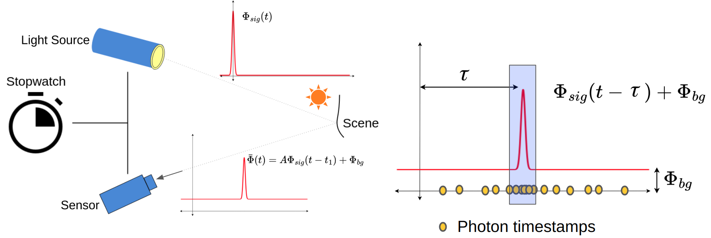

3D Single Photon Camera
=======================

3D single-photon cameras (3D SPCs) are promising candidates for high-resolution and high-sensitivity 3D imaging. These systems leverage the time-of-flight (ToF) principle to estimate scene depth by measuring the time it takes for photons to travel from an active light source, reflect off objects in the scene, and return to the sensor. Unlike conventional ToF sensors, which accumulate continuous light intensity, 3D SPCs use Single-Photon Avalanche Diodes (SPADs) to detect and timestamp individual photons with picosecond-level precision.

ToF Imaging Model
-----------------

In a typical setup, the scene is illuminated using short-duration laser pulses, and the camera records the time-varying distribution of light intensity reflected back from the scene, called the transient distribution.

The figure illustrates how SPCs sample the transient distribution :math:`\Phi(t)` by digitizing and recording the returning photon timestamps. :math:`\Phi_{sig}` represents the average signal photons incident on the sensor per laser cycle, :math:`\Phi_{bkg}` represents the average background photons which includes photons due to ambient light sources and photons detected due to sensor dark counts, and :math:`A` is a scaling factor that encapsulates the effect of scene reflectance, photon detection efficiency and distance square fall-off.

Equi-width and Equi-depth Histogrammers
---------------------------------------

Conventional SPCs use equi-width histogrammers (EWH) to compress the timestamp data into equi-width histograms where each histogram bin represents an equal time interval. Recently, researchers have proposed more efficient 3D SPCs which use histogrammers that compress the data into equi-depth histograms. ED histograms use variable-width bins such that each bin contains (approximately) equal photon
counts. The term “depth” in equi-depth refers to the equal photon counts in each histogram bin and should not be confused with scene distance.

.. warning:: Current version of VisionSim uses `SPCSim library <https://github.com/kaustubh-sadekar/SPCSimLib/tree/main>`_ [1]_ to simulate 3D SPCs. Future versions of VisionSim will integrate 3D SPC modules as part of the emulate package.

`SPCSim library <https://kaustubh-sadekar.github.io/SPCSimLib/index.html>`_ contains several 3D SPCs classes. For the current version of VisionSim, emulating SPC data is a three step process (1) Generate RGB-D frames using the blender animation functionalities, (2) use the `TransientGenerator` class to generate transient :math:`\Phi(t)` from the RGB-D frames for desired sensor properties and illumination condition, and finally (3) use the transients generated from SPCSim to emulate 3D SPC measurements for desired number of laser cycles.

The SPCSim library also contains post-processing module to generate distance estimates from the emulated SPC measurements. 

Emulating Transient Data
------------------------

The following code example explains how to set sensor properties and illumination conditions and generate transient data.

.. code-block:: python

    Nr, Nc = [128, 128]  # SPC sensor resolution
    N_tbins = 1024       # Number of discrete time bins for "ideal" transient
    tmax = 100           # Laser period in nano seconds
    FWHM = 1             # Laser full wave half maximum in terms of bin-width
    N_pulses = 1000      # Number of laser cycles to use
    alpha_sig = 1.0      # Average signal photons per laser cycle
    alpha_bkg = 4.0      # Average background photons per laser cycle
    device = "cpu"       # Torch device
    
    tr_gen = TransientGenerator(Nr = Nr, 
                                Nc = Nc, 
                                N_tbins = N_tbins, 
                                tmax = tmax, 
                                FWHM = FWHM)

    # Generating transient data for given scene properties and illumination conditions    
    phi_bar = tr_gen.get_transient(
                                dist_img,
                                albedo,
                                intensity,
                                torch.tensor(alpha_sig),
                                torch.tensor(alpha_bkg),
                            )

The following code example explains how to emulate 32-bin EWH SPC data using the generated transient data.

.. code-block:: python

    N_bins = 128          # Number of histogram bins

    # Creating instance to simulate EWH SPC measurements
    spc = BaseEWHSPC(Nr, Nc, N_pulses, device, N_tbins, int(N_bins))
    
    # Simulating measurements SPCs using equi-width histogrammers for generated transient data
    captured_data = spc.capture(phi_bar)

    # Extracting generated EWH measurements
    ewh_data = captured_data["ewh"]

    # Estimate distance from EWH SPC measurements
    ewh_postproc = PostProcEWH(Nr, Nc, N_tbins, tmax, device)
    _, estimated_depth = ewh_postproc.ewh2depth_t(ewh_data)

The following code example explains how to emulate 32-bin EDH SPC data using the generated transient data.

.. code-block:: python

    N_bins = 16          # Number of histogram bins
    
    # Creating instance to simulate EDHSPC measurements
    spc = BaseEDHSPC(Nr, Nc, N_pulses, device, N_tbins, int(N_bins))
    
    # Simulating measurements SPCs using equi-depth histogrammers for generated transient data
    captured_data = spc.capture(phi_bar)

    # Extracting generated EDH measurements
    oedh_data = captured_data["oedh"]

    # Estimate distance from EDH SPC measurements
    edh_postproc = PostProcEDH(Nr, Nc, N_tbins, tmax, device)
    _, _, _, estimated_depth = edh_postproc.edh2depth_t(oedh_data[..., 1:-1], mode=1)

.. image:: ../../_static/sensors/Emulate_3DSPCs.png
   :align: center

Observe how EDH SPCs can estimate more accurate scene distances with lower number of histogram bins as compared to EWH SPCs. 

.. warning:: Refer to `this tutorial <https://kaustubh-sadekar.github.io/SPCSimLib/notebooks/TutorialCreateCustomEDH.html>`_  to design SPCs with custom histogrammers. Future versions of VisionSim will integrate 3D SPC modules as part of the `emulate` package.

.. [1] Sadekar, K., Maier, D., Ingle, A. (2025). Single-Photon 3D Imaging with Equi-Depth Photon Histograms. In: Leonardis, A., Ricci, E., Roth, S., Russakovsky, O., Sattler, T., Varol, G. (eds) Computer Vision – ECCV 2024. ECCV 2024. Lecture Notes in Computer Science, vol 15122. Springer, Cham. https://doi.org/10.1007/978-3-031-73039-9_22
