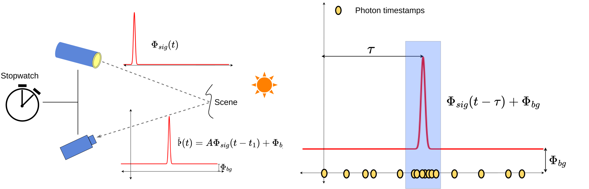
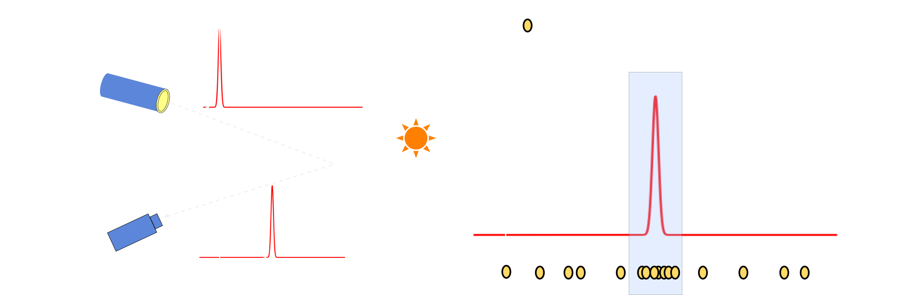
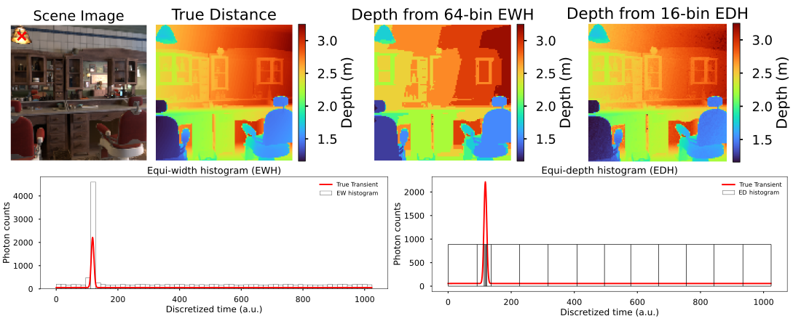
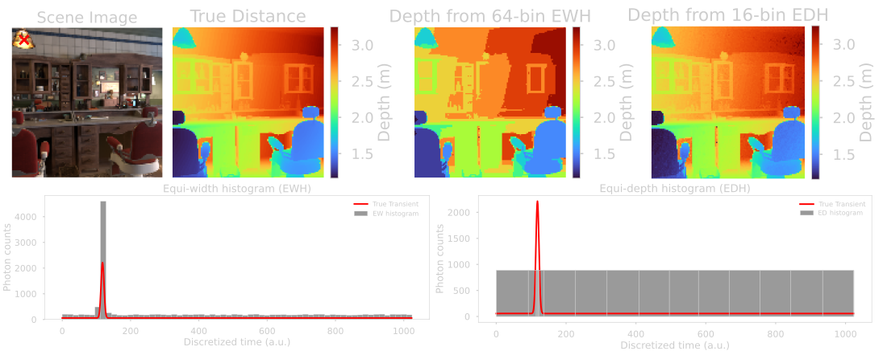

Active Single Photon Camera
===========================

Single-photon cameras (SPCs) are gaining popularity as promising candidates for high-resolution 3D imaging when combined with an active illumination source [1]_ [2]_. These systems leverage the time-of-flight (ToF) principle to estimate scene depth by measuring the time it takes for photons to travel from an active light source, reflect off objects in the scene, and return to the sensor. Unlike conventional ToF sensors, which accumulate continuous light intensity, active SPCs use Single-Photon Avalanche Diodes (SPADs) to detect and timestamp individual photons with picosecond-level precision.

|

ToF Imaging Model
-----------------

In a typical setup, the scene is illuminated using short-duration laser pulses, and the camera records the time-varying distribution of light intensity reflected back from the scene, called the transient distribution.

The figure illustrates how SPCs sample the transient distribution :math:`\Phi(t)` by digitizing and recording the returning photon timestamps. :math:`\Phi_{sig}` represents the average signal photons incident on the sensor per laser cycle, :math:`\Phi_{bkg}` represents the average background photons which includes photons due to ambient light sources and photons detected due to sensor dark counts, and :math:`A` is a scaling factor that encapsulates the effect of scene reflectance, photon detection efficiency and distance square fall-off.

|

Equi-width and Equi-depth Histogrammers
---------------------------------------

Conventional SPCs use equi-width histogrammers (EWH) to compress the timestamp data into equi-width histograms where each histogram bin represents an equal time interval. Recently, researchers have proposed more efficient active SPCs which use histogrammers that compress the data into equi-depth histograms. Equi-depth histogrammers (EDH) use variable-width bins such that each bin contains (approximately) equal photon
counts. 

.. note:: The term “depth” in equi-depth refers to the equal photon counts in each histogram bin and should not be confused with scene distance.

.. warning:: Current version of VisionSim uses `SPCSim library <https://github.com/kaustubh-sadekar/SPCSimLib/tree/main>`_ [3]_ to simulate active SPCs. Future versions of VisionSim will integrate active SPC modules as part of the emulate package.

Currently, emulating SPC data is a three step process:
   1. Generate RGB-D frames using the :doc:`blender animation functionalities <../../simulation>`, 
   2. Use the ``TransientGenerator`` class to generate transients :math:`\Phi(t)` from the RGB-D frames for desired sensor properties and illumination condition, 
   3. Use the transients generated from SPCSim to emulate active SPC measurements for desired number of laser cycles.

The SPCSim library also contains post-processing module to generate distance estimates from the emulated SPC measurements as well as several active SPCs classes. 

|

Emulating Transient Data
------------------------

To emulate transient data, we first set up sensor properties and illumination conditions, then generate ground truth transients for each pixel like so:

..  literalinclude:: ../../../../../examples/sensors/edh_spc.py
    :lines: 20-27, 47-59

From these ground truth transients we can emulate equi-width histograms and estimate scene distance from these measurements:

.. literalinclude:: ../../../../../examples/sensors/ewh_spc.py
   :lines: 61-70

We can do the same with equi-depth histograms like so:

.. literalinclude:: ../../../../../examples/sensors/edh_spc.py
   :lines: 61-70

Plotting the results, we can see that equi-depth histograms can estimate more accurate scene distances with lower number of histogram bins than EWH SPCs.

.. seealso:: Refer to `this tutorial <https://kaustubh-sadekar.github.io/SPCSimLib/notebooks/TutorialCreateCustomEDH.html>`_  to design SPCs with custom histogrammers. 

.. [1] `Gupta, Anant & Ingle, Atul & Gupta, Mohit. (2019). "Asynchronous Single-Photon 3D Imaging". <https://arxiv.org/pdf/1908.06372>`_

.. [2] `Vladimir Koifman. "Apple iPad and Ouster LiDARs Compared". Image Sensors World. <https://image-sensors-world.blogspot.com/2020/04/apple-ipad-and-ouster-lidars-compared.html>`_

.. [3] `Sadekar, K., Maier, D., Ingle, A. (2025). "Single-Photon 3D Imaging with Equi-Depth Photon Histograms". <https://arxiv.org/pdf/2408.16150>`_
