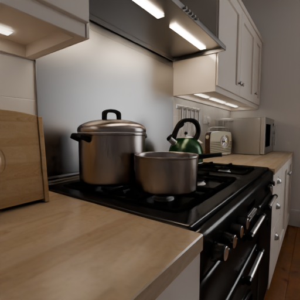

Light Passes
============

A render is a single flattened image: once it is written you cannot change the lighting without rendering again. The light passes split that image into the parts it is made of, one per kind of light interaction, so a scene can be relit, recolored or re-composited after the fact from the same set of rendered frames. Cycles calls the specular passes "Glossy" throughout its interface.

|

Enabling them
-------------

Pass ``--config.include-diffuse-pass`` and/or ``--config.include-specular-pass`` to render them alongside the combined frame:

.. code-block:: bash

    visionsim blender.render-animation scene.blend output/ \
        --config.include-diffuse-pass \
        --config.include-specular-pass

Every flag and render option works the same with :func:`blender.render-frame <visionsim.cli.blender.render_frame>`, which renders a single frame instead.

The passes land beside ``frames/`` in one directory per pass, each with its own ``transforms.db`` describing that pass's camera:

- ``diffuse/direct``, ``diffuse/indirect``, ``diffuse/color``
- ``specular/direct``, ``specular/indirect``, ``specular/color``

They are written as 32-bit EXR, because the values are linear light rather than display-ready color. Cycles and EEVEE name these differently; see the note under the diagram below.

By default the direct and indirect passes are denoised individually as they are saved, since they can be very noisy in dark regions, particularly at low sample counts. The color passes are never denoised, being noise-free by nature. Set ``--config.diffuse-pass.denoise=false`` or ``--config.specular-pass.denoise=false`` to save them raw instead, and note that this only applies to Cycles.

|

The passes
----------

Here, each pass is tone-mapped independently, so these show the structure each one carries rather than how bright it is relative to the others:

.. grid:: 3
    :gutter: 2

    .. grid-item::

        .. figure:: ../_static/blender/light-passes/diffuse-direct.png

            Diffuse Direct

    .. grid-item::

        .. figure:: ../_static/blender/light-passes/diffuse-indirect.png

            Diffuse Indirect

    .. grid-item::

        .. figure:: ../_static/blender/light-passes/diffuse-color.png

            Diffuse Color

    .. grid-item::

        .. figure:: ../_static/blender/light-passes/specular-direct.png

            Glossy Direct

    .. grid-item::

        .. figure:: ../_static/blender/light-passes/specular-indirect.png

            Glossy Indirect

    .. grid-item::

        .. figure:: ../_static/blender/light-passes/specular-color.png

            Glossy Color

|

Diffuse Direct is the light reaching surfaces straight from a source, and Diffuse Indirect is what has bounced off something else first. Their sum has no surface color in it at all: Diffuse Color supplies that, which is why it reads as a flat, unlit albedo map. The glossy passes follow the same split for reflections, and specular highlights are what the direct and indirect glossy passes isolate. Together these are combined to give you the final render:

   Combined

|

How the passes combine
----------------------

The individual passes add and multiply back into the combined image. The lighting passes are simply summed, since they are each a separate contribution to the same pixel. The color passes are not light at all but base color, so they are multiplied in: ``(diffuse direct + diffuse indirect) × diffuse color`` gives back the diffuse lighting of the final render, and the same holds for the glossy passes before the two are added together.

.. tab-set::

    .. tab-item:: Cycles

        .. figure:: ../_static/blender/light-passes/combine-cycles.svg
           :align: center

           Cycles pass combination.

    .. tab-item:: EEVEE

        .. figure:: ../_static/blender/light-passes/combine-eevee.svg
           :align: center

           EEVEE pass combination.

Diagram from the `Blender manual <https://docs.blender.org/manual/en/latest/render/layers/passes.html#combining>`_.

EEVEE does not separate direct from indirect light, nor support transmission passes, so it writes ``diffuse/light`` and ``specular/light`` alongside the two color passes instead of the three-way split shown for Cycles.

|

Caveats
-------

Only the diffuse and glossy passes described above are available. Blender can also expose transmission, volume, emission and environment passes, but ``render-animation`` does not render those yet, so a scene that leans on glass or volumetrics needs them composited by hand in Blender.

Each pass is stored as a linear EXR at the render's full resolution, so enabling them can take significant disk space, several times that of the frames themselves. Saving them as half-float or with a lighter codec brings that back down at some precision cost.

They are also unavailable from :doc:`blender.render-playblast <playblast>`. The viewport renderer has no equivalent of Cycles' light passes, so ``include_*`` flags are ignored and only the color preview is written.
